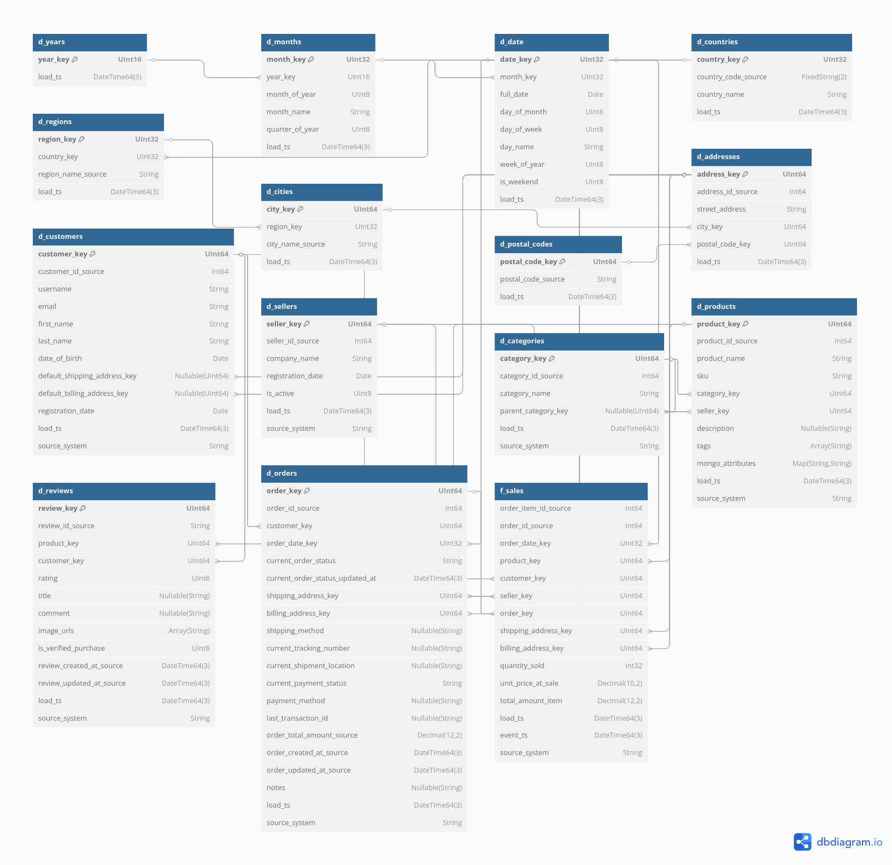

## 1. Структура модуля **`analytics`**

```
ecommerce_platform/
├── analytics/
│   ├── analytics_test_data_loader/
│   │   ├── Dockerfile
│   │   └── analytics_test_data_loader.py   # Загрузка тестовых данных для витрины
│   ├── clickhouse_init/
│   │   ├── create_schema.sql               # Схема в формате Snowflake
│   │   └── create_views.sql                # Аналитические витрины
│   ├── etl_job/
│   │   ├── Dockerfile
│   │   └── etl_job.py                      # Spark-job for ETL
│   ├── libs/                               # Требуемые jar-драйвера
│   ├── README.md 
│   └── launch_instruction_analytics.
├── docker-compose.yml                      # Основной docker-compose файл
```

| Зависимые компоненты модуля |
| :------------------------------------ |
| clickhouse |
| metabase |
| analytics_etl |
| spark-worker |
| spark-master |


## 2. Принцип работы **`analytics`**

1. `etl_job.py` — ETL-скрипт на Apache Spark, который автоматизирует процесс агрегации и загрузки данных.

- Основные задачи etl-job:
    - Подключение к ClickHouse с помощью JDBC для чтения и записи данных.
    - Чтение всех таблиц «снежинки» (dimension) и таблицы фактов f_sales как DataFrame.
    - Выполнение агрегированных расчётов (GroupBy, аггрегатные функции, оконные функции) для каждого отчёта.
    - Загрузка результатов в целевые таблицы-отчёты в ClickHouse.

2. `analytics_test_data_loader.py` — скрипт загрузки тестовых данных для витрины.

## 3. Схема БД Clickhouse **`create_schema.sql`**

- Составлена в формате Snowflake



### Таблицы Измерений (Dimensions)

Таблицы измерений содержат описательные атрибуты, по которым можно фильтровать, группировать и агрегировать данные. Они относительно статичны и часто дополняются новыми записями, но редко изменяются.

* **`d_years` (Годы)**
    * **`year_key`**: Уникальный ключ для года.
    * Представляет годы как измерение для анализа временных рядов.

* **`d_months` (Месяцы)**
    * **`month_key`**: Уникальный ключ для месяца.
    * **`year_key`**: Ссылка на соответствующий год.
    * **`month_of_year`**, **`month_name`**, **`quarter_of_year`**: Детализация месяца.
    * Используется для анализа по месяцам и кварталам.

* **`d_date` (Даты)**
    * **`date_key`**: Уникальный ключ для конкретной даты.
    * **`month_key`**: Ссылка на соответствующий месяц.
    * **`full_date`**: Полная дата.
    * **`day_of_month`**, **`day_of_week`**, **`day_name`**, **`week_of_year`**, **`is_weekend`**: Атрибуты даты.
    * Ключевое измерение для анализа данных по дням, неделям и другим временным интервалам.

* **`d_countries` (Страны)**
    * **`country_key`**: Уникальный ключ страны.
    * **`country_code_source`**, **`country_name`**: Код и название страны.
    * Используется для гео-аналитики на уровне стран.

* **`d_regions` (Регионы)**
    * **`region_key`**: Уникальный ключ региона.
    * **`country_key`**: Ссылка на соответствующую страну.
    * **`region_name_source`**: Название региона.
    * Позволяет анализировать данные по регионам внутри стран.

* **`d_cities` (Города)**
    * **`city_key`**: Уникальный ключ города.
    * **`region_key`**: Ссылка на соответствующий регион.
    * **`city_name_source`**: Название города.
    * Детализация до уровня городов для гео-аналитики.

* **`d_postal_codes` (Почтовые индексы)**
    * **`postal_code_key`**: Уникальный ключ почтового индекса.
    * **`postal_code_source`**: Сам почтовый индекс.
    * Используется для детализации адресов по почтовым индексам.

* **`d_addresses` (Адреса)**
    * **`address_key`**: Уникальный ключ адреса в хранилище.
    * **`address_id_source`**: Исходный идентификатор адреса (из OLTP системы).
    * **`street_address`**, **`city_key`**, **`postal_code_key`**: Детали адреса с ссылками на город и почтовый индекс.
    * Используется для анализа по адресам доставки/выставления счетов.

* **`d_customers` (Покупатели)**
    * **`customer_key`**: Уникальный ключ покупателя в хранилище.
    * **`customer_id_source`**: Исходный идентификатор покупателя.
    * **`username`**, **`email`**, **`first_name`**, **`last_name`**, **`date_of_birth`**: Персональные данные покупателя.
    * **`default_shipping_address_key`**, **`default_billing_address_key`**: Ссылки на адреса по умолчанию.
    * **`registration_date`**: Дата регистрации.
    * **`source_system`**: Система-источник данных.
    * Основное измерение для анализа поведения клиентов.

* **`d_sellers` (Продавцы)**
    * **`seller_key`**: Уникальный ключ продавца в хранилище.
    * **`seller_id_source`**: Исходный идентификатор продавца.
    * **`company_name`**, **`registration_date`**, **`is_active`**: Детали продавца.
    * **`source_system`**: Система-источник данных.
    * Используется для анализа продаж по продавцам.

* **`d_categories` (Категории)**
    * **`category_key`**: Уникальный ключ категории в хранилище.
    * **`category_id_source`**: Исходный идентификатор категории.
    * **`category_name`**, **`parent_category_key`**: Название категории и ссылка на родительскую категорию (для иерархии).
    * **`source_system`**: Система-источник данных.
    * Позволяет анализировать продажи по категориям продуктов.

* **`d_products` (Продукты)**
    * **`product_key`**: Уникальный ключ продукта в хранилище.
    * **`product_id_source`**: Исходный идентификатор продукта.
    * **`product_name`**, **`sku`**, **`description`**, **`tags`**, **`mongo_attributes`**: Детали продукта.
    * **`category_key`**, **`seller_key`**: Ссылки на категорию и продавца.
    * **`source_system`**: Система-источник данных.
    * Центральное измерение для анализа продаж по конкретным товарам.

* **`d_reviews` (Отзывы)**
    * **`review_key`**: Уникальный ключ отзыва в хранилище.
    * **`review_id_source`**: Исходный идентификатор отзыва.
    * **`product_key`**, **`customer_key`**: Ссылки на продукт и покупателя.
    * **`rating`**, **`title`**, **`comment`**, **`image_urls`**, **`is_verified_purchase`**: Детали отзыва.
    * **`review_created_at_source`**, **`review_updated_at_source`**: Исходные отметки времени отзыва.
    * **`source_system`**: Система-источник данных.
    * Используется для анализа качества продуктов и удовлетворенности клиентов.

* **`d_orders` (Заказы)**
    * **`order_key`**: Уникальный ключ заказа в хранилище.
    * **`order_id_source`**: Исходный идентификатор заказа.
    * **`customer_key`**, **`order_date_key`**: Ссылки на покупателя и дату заказа.
    * **`current_order_status`**, **`current_order_status_updated_at`**: Текущий статус заказа.
    * **`shipping_address_key`**, **`billing_address_key`**: Ссылки на адреса доставки и оплаты.
    * **`shipping_method`**, **`current_tracking_number`**, **`current_shipment_location`**: Детали доставки.
    * **`current_payment_status`**, **`payment_method`**, **`last_transaction_id`**: Детали оплаты.
    * **`order_total_amount_source`**: Исходная общая сумма заказа.
    * **`order_created_at_source`**, **`order_updated_at_source`**: Исходные отметки времени заказа.
    * **`notes`**: Примечания к заказу.
    * **`source_system`**: Система-источник данных.
    * Измерение, представляющее информацию о заказах.

---

### Таблица Фактов (Facts)

- Таблица фактов содержит метрики, подлежащие агрегации и анализу, а также внешние ключи к таблицам измерений.
- Является основным источником для построения отчетов о доходах, объеме продаж, популярных товарах и т.д.

* **`f_sales` (Продажи)**
    * **`order_item_id_source`**, **`order_id_source`**: Исходные идентификаторы элемента заказа и самого заказа.
    * **`order_date_key`**: Ссылка на дату продажи.
    * **`product_key`**: Ссылка на проданный продукт.
    * **`customer_key`**: Ссылка на покупателя.
    * **`seller_key`**: Ссылка на продавца.
    * **`order_key`**: Ссылка на заказ.
    * **`shipping_address_key`**, **`billing_address_key`**: Ссылки на адреса доставки и оплаты для конкретной позиции заказа.
    * **`quantity_sold`**: Количество проданных единиц товара (метрика).
    * **`unit_price_at_sale`**: Цена за единицу на момент продажи (метрика).
    * **`total_amount_item`**: Общая сумма за этот пункт заказа (метрика).
    * **`event_ts`**: Отметка времени события продажи (важно для ClickHouse).
    * **`source_system`**: Система-источник данных.
---

### Общие Атрибуты 

* **`load_ts` (DateTime64(3))**: Отметка времени, когда запись была загружена в хранилище данных. Это очень полезно для отслеживания ETL-процессов (Extract, Transform, Load) и понимания свежести данных.
* **`ENGINE = MergeTree()`**: Указывает на использование движка `MergeTree`, который является основным и наиболее производительным движком таблиц в ClickHouse, оптимизированным для аналитических запросов с агрегацией и фильтрацией по диапазонам.
* **`ORDER BY (...)`**: Определяет порядок сортировки данных на диске, что критически важно для производительности запросов в ClickHouse. Обычно сортировка происходит по ключевым столбцам, которые чаще всего используются в `GROUP BY` и `WHERE` условиях.


## 4. Описание **`create_views.sql`**

| Название представления          | Описание                                                                  |
| :------------------------------ | :------------------------------------------------------------------------ |
| `v_avg_order_value_monthly`     | Средняя стоимость заказа по месяцам. Группировка по году и месяцу.         |
| `v_category_revenue`            | Выручка по каждой товарной категории. Группировка по категории.             |
| `v_customer_avg_order_value`    | Средний чек на одного покупателя. Группировка по покупателю.              |
| `v_customer_country_distribution`| Распределение покупателей по странам. Группировка по стране.              |
| `v_daily_orders_and_revenue`    | Ежедневная статистика по количеству заказов и выручке.                    |
| `v_order_status_distribution`   | Распределение статусов заказов (выполненные, отменённые и т. д.).         |
| `v_products_best_and_worst_rated`| Товары с наилучшими и наихудшими средними отзывами.                       |
| `v_products_most_reviewed`      | Товары, собравшие наибольшее количество отзывов.                          |
| `v_rating_sales_correlation`    | Корреляция рейтинга товара и объёма продаж.                               |
| `v_sales_distribution_by_location`| Распределение выручки и количества продаж по регионам, странам и городам. |
| `v_sales_period_comparison`     | Сравнение продаж за текущий и предыдущий период (месяц, квартал).         |
| `v_sales_trends`                | Динамика продаж (выручка) за выбранный период (месяцы).                   |
| `v_seller_avg_order_value`      | Средний чек по каждому продавцу. Группировка по продавцу.                 |
| `v_top_10_customers_by_total_spent`| Топ-10 покупателей по общей сумме покупок.                                |
| `v_top_10_products_by_quantity` | Топ-10 товаров по количеству продаж.                                      |
| `v_top_5_sellers_by_revenue`    | Топ-5 продавцов по выручке.                                               |
| `v_top_5_suppliers_by_revenue`  | Топ-5 поставщиков по выручке.                                             |

