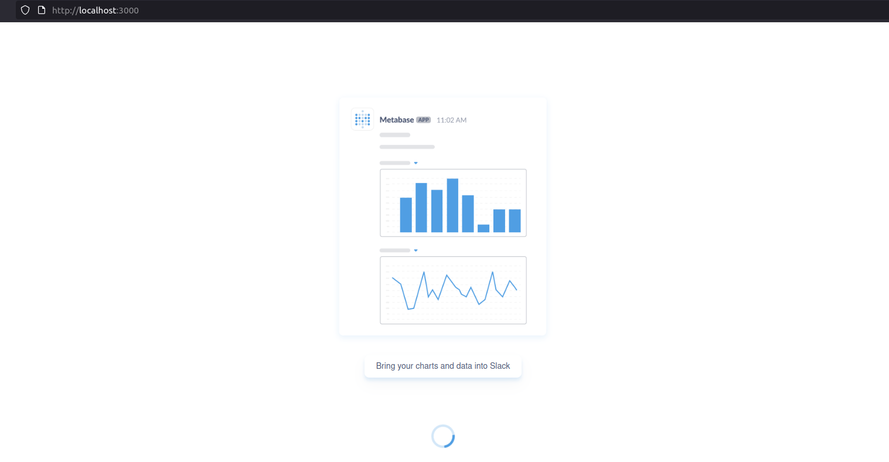
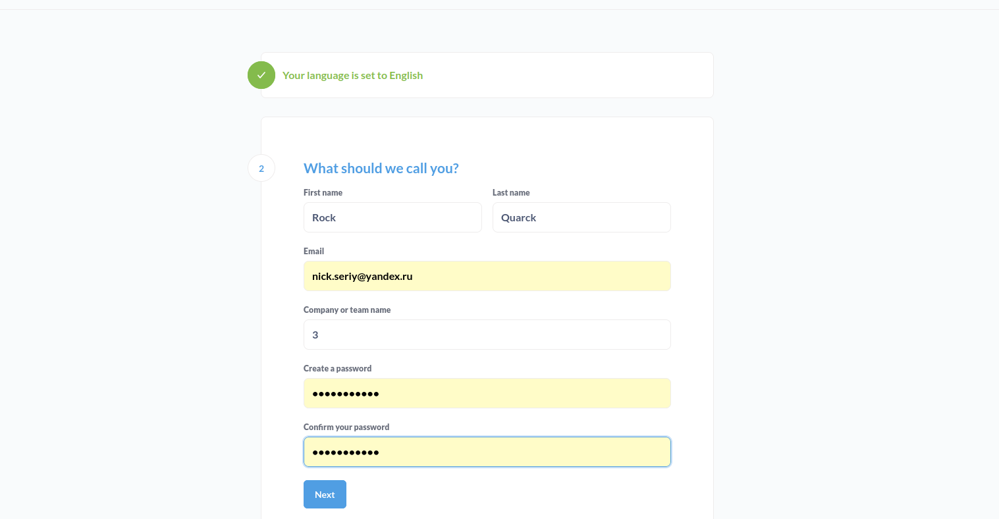
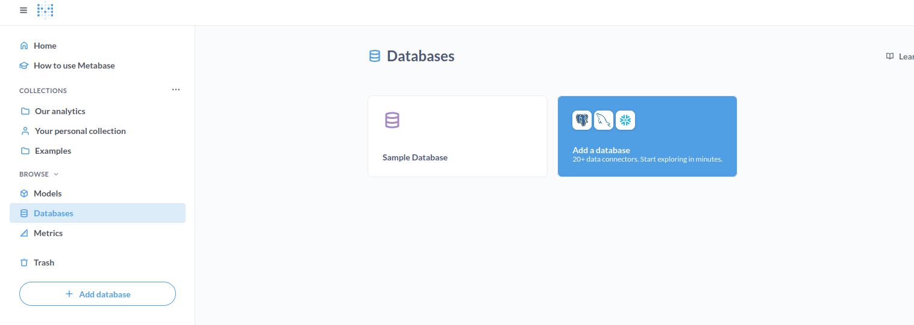
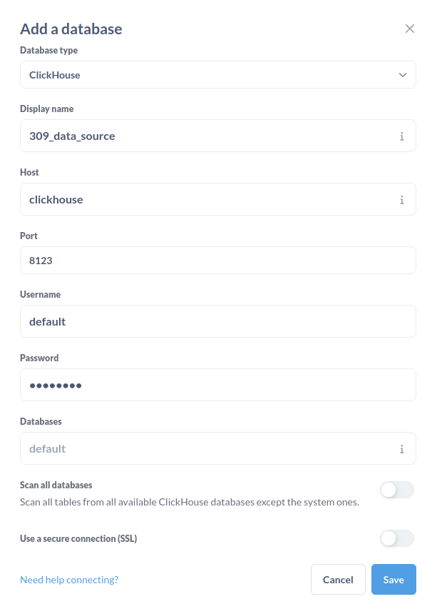
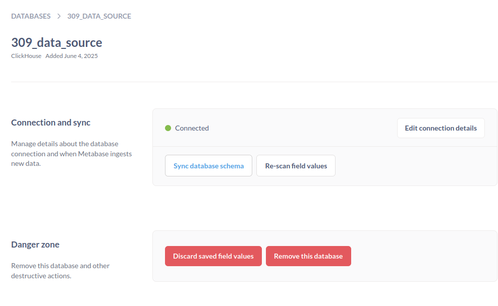
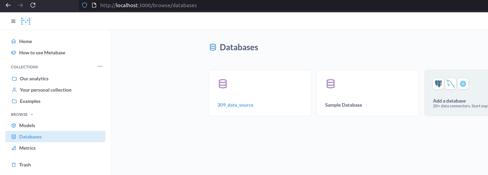
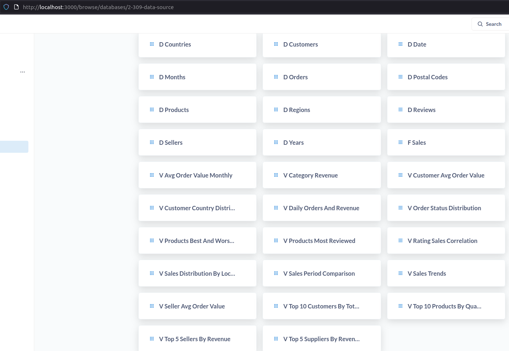
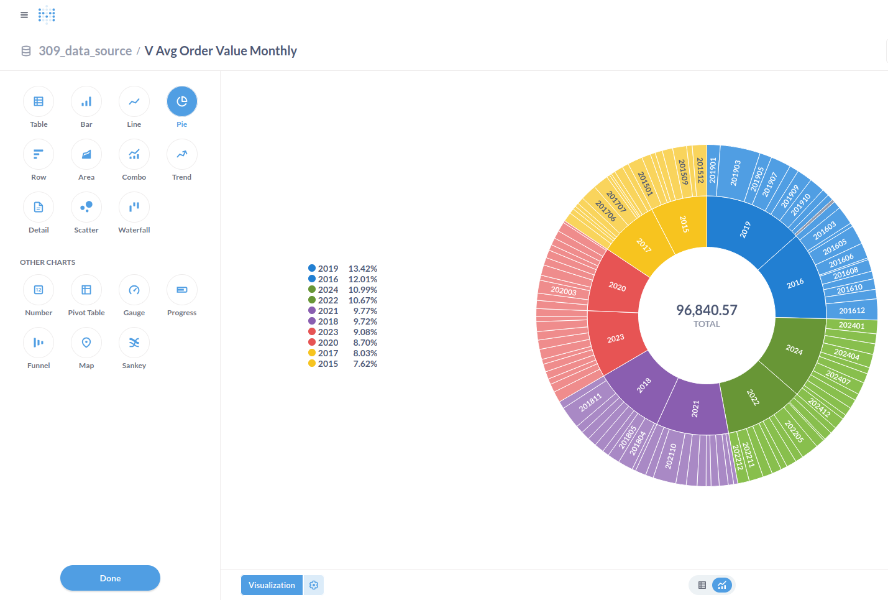
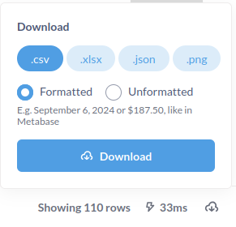

# Инструкция по запуску модуля **`analytics`**

## Шаг 1. Запуск контейнеров:

- Убедитесь, что вы в корневой папке проекта.
```sh
docker-compose -f docker-compose.yml up --build -d
```

## Шаг 2. Проверка работоспособности скриптов (через терминал bash в текущей директории):

- Проверка, что данные загружены в таблицу:

```sh
# Для analytics/analytics_test_data_loader/analytics_test_data_loader.py:
docker logs -f analytics_test_data_loader_init
# Должно появиться сообщение: "Успешно сгенерировано"

docker exec -it clickhouse clickhouse-client
select count(*) from d_customers
# Должны получить значение 500

```

- Проверка, что представления заполнены `etl_job.py`:

```sh
# Для analytics/etl_job/etl_job.py

docker logs -f analytics_etl_job

docker exec -it clickhouse clickhouse-client

SELECT * FROM v_top_10_products_by_quantity;

SELECT * FROM v_category_revenue;

SELECT * FROM v_sales_trends ORDER BY year_key, month_key LIMIT 10;

```

# Работа с Metabase 

```sh
# Проверка работоспособности контейнера

docker logs -f metabase

```

- Для открытия BI-визуализации перейдите в браузере по адресу: http://localhost:3000/



## Шаг 1: Авторизация пользователя

- Введите ваши пользовательские данные.




## Шаг 2: Подключение Базы данных

1. Перейдите в раздел Browse/Databases в левой панели проводника и выберите Add a Database.




2. Заполните следующие поля согласно сервису "clickhouse" в docker-compose.yml для подключения.




3. Синхронизируйте состояние БД.




## Шаг 3: Просмотр аналитической витрины

1. Перейдите во вкладку Browse/Databases и выберите появившуюся БД





2. Выберите интересующую вас витрину v_view 



3. Формат представления подбирайте во вкладке Visualisation.



4. Для демонстрации отчетов доступна выгрузка в указанных форматах.




