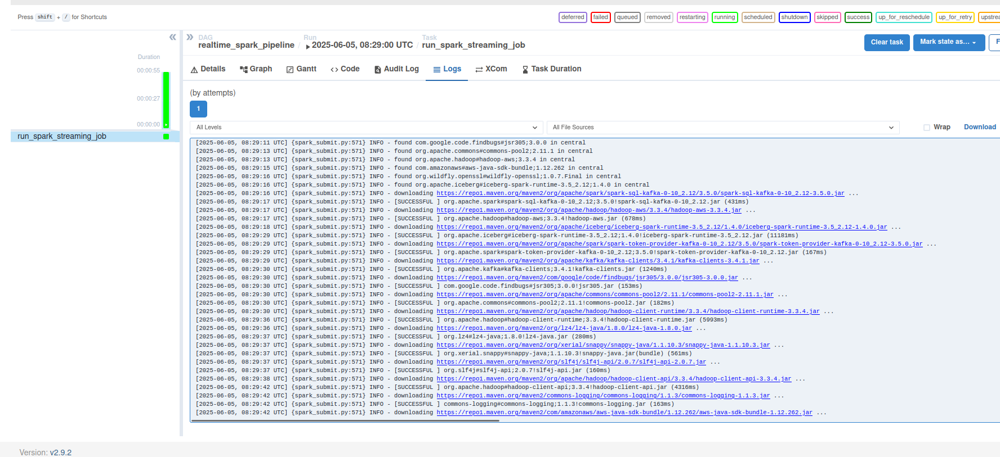

# **Инструкция по запуску Batching для **`ecommerce_platform`**


## Шаг 1. Перезагрузка (при необходимости)

- Проверьте что порты в docker-compose.yml и Dockerfile совпадают/
- По смене несоответствий перезагрузите контейнеры:

```sh
docker-compose down 
docker-compose up -d --build

```

## Шаг 2: Просмотр логирования сервисов (через терминал)

- Для причастных к batching сервисов:

```sh

docker-compose logs -f airflow-webserver

docker-compose logs -f airflow-scheduler

docker-compose logs -f airflow-init

docker-compose logs -f airflow-db

docker-compose logs -f minio

docker-compose logs -f spark-master

docker-compose logs -f spark-worker

docker-compose logs -f analytics

```


## Шаг 3: Просмотр Web-UI Airflow

1) Перейдите по адресу http://localhost:8081.

2) Авторизуйтесь:

- Username: airflow
- Password: airflow

3) В веб-интерфейсе Airflow вы увидите список DAG-ов.

1. orchestrate_realtime_ingestion —  для стримингового Spark-приложения по перемещению данных из Kafka в Iceberg на MinIO.
2. orchestrate_daily_data_refinement —  для ежедневного батч-процессинга.


## Шаг 4: Логи Airflow DAGs через Web-UI

1. Перейдите на страницу http://localhost:8081/
2. Нажмите на последний или текущий запуск нужного DAG.
3. В представлении "Graph View" или "Grid View" нажмите на конкретную задачу 
4. В открывшемся окне задачи выберите вкладку "Log".



## Шаг 5: Web-UI Spark Master

- Используется для мониторинга состояния Spark-кластера. 
- Здесь доступны:
    - список подключенных Spark Worker-ов,
    - информация о запущенных Spark-приложениях,
    - логи и потребление ресурсов.

1. Перейдите по адресу http://localhost:8080

- проверка в web-ui, что спарк сработал.


## Шаг 6: Web-UI MinIO

- Здесь вы сможете увидеть бакет ecommerce-data и директории iceberg_warehouse и checkpoints, где Spark сохраняет данные и чекпоинты.

1. Перейдите по адресу http://localhost:9006
2. Авторизуйтесь:
- Access Key: minioadmin
- Secret Key: minioadmin


- проверка на то, что данные из кафки идут в s3.

