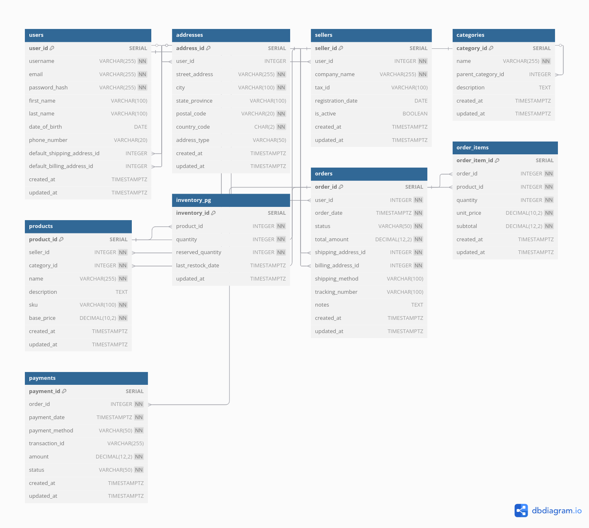
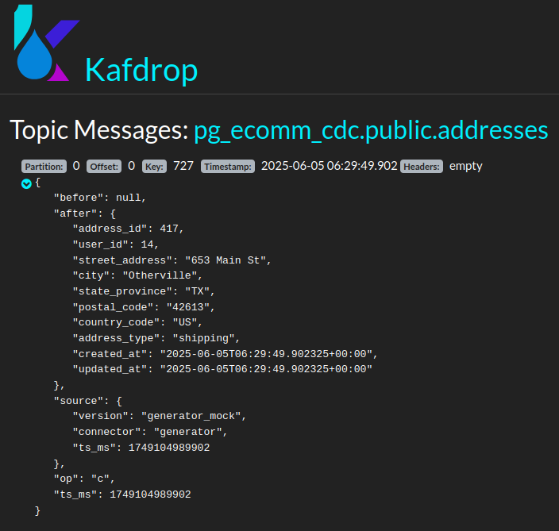
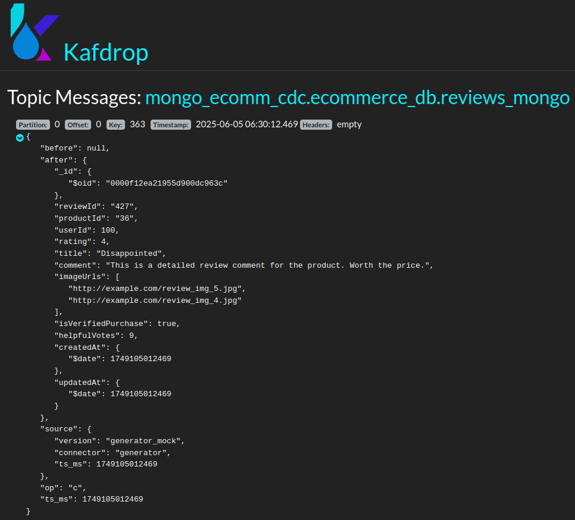
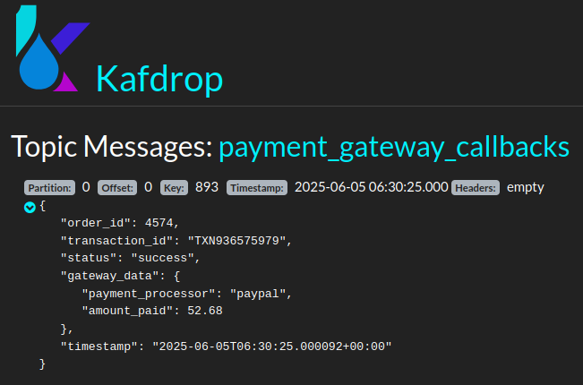

## 1. Структура модуля **`infra`**

```
ecommerce_platform/
├── infra/
│   ├── kafka-connect/
│   │   └── connectors/
│   │           ├── register-mongo.json
│   │           └── register-postgres.json
│   ├── mongo/
│   │   ├── create_mongo_key.sh
│   │   └── fill_mongo.sh
│   ├── postgres/
│   │   ├── init.sql                         # Данные о продажах
│   │   └── metabase_init.sql                # Хранение данных витрины metabase
│   ├── README.md 
│   └── register_connectors.sh
├── docker-compose.yml                       # Основной docker-compose файл
```

| Зависимые компоненты модуля |
| :------------------------------------ |
| kafdrop |
| kafka-connect |
| kafka |
| zookeeper |
| mongo |
| mongo-setup |
| postgres |


## 2. Схема БД Postgres **`init.sql`** 





## Основные сущности схемы БД Postgres

### `users` (Пользователи)
Эта таблица хранит информацию о зарегистрированных пользователях системы.
* **`user_id`**: Уникальный идентификатор пользователя.
* **`username`**, **`email`**, **`password_hash`**: Данные для входа и контакта.
* **`first_name`**, **`last_name`**, **`date_of_birth`**, **`phone_number`**: Личные данные пользователя.
* **`default_shipping_address_id`**, **`default_billing_address_id`**: Ссылки на адреса по умолчанию для доставки и выставления счетов (хранятся в таблице `addresses`).
* **`created_at`**, **`updated_at`**: Отметки времени создания и последнего обновления записи.

### `addresses` (Адреса)
Содержит детали физических адресов, которые могут быть связаны с пользователями (например, для доставки или выставления счетов).
* **`address_id`**: Уникальный идентификатор адреса.
* **`user_id`**: Ссылка на пользователя, которому принадлежит этот адрес (может быть NULL, если адрес используется, но не привязан напрямую к одному пользователю).
* **`street_address`**, **`city`**, **`state_province`**, **`postal_code`**, **`country_code`**: Компоненты адреса.
* **`address_type`**: Тип адреса (например, "дом", "работа").
* **`created_at`**, **`updated_at`**: Отметки времени.

### `sellers` (Продавцы)
Хранит информацию о продавцах или компаниях, которые предлагают товары на платформе. Каждый продавец связан с существующим пользователем.
* **`seller_id`**: Уникальный идентификатор продавца.
* **`user_id`**: Ссылка на соответствующего пользователя (каждый продавец — это также пользователь).
* **`company_name`**: Название компании продавца.
* **`tax_id`**: Налоговый идентификатор компании.
* **`registration_date`**: Дата регистрации продавца.
* **`is_active`**: Флаг активности продавца.
* **`created_at`**, **`updated_at`**: Отметки времени.

### `categories` (Категории)
Организует товары по категориям, поддерживая иерархическую структуру (например, "Электроника" -> "Телефоны").
* **`category_id`**: Уникальный идентификатор категории.
* **`name`**: Название категории.
* **`parent_category_id`**: Ссылка на родительскую категорию, если таковая имеется (для создания иерархии).
* **`description`**: Описание категории.
* **`created_at`**, **`updated_at`**: Отметки времени.

### `products` (Продукты)
Содержит детали о товарах, доступных для продажи.
* **`product_id`**: Уникальный идентификатор продукта.
* **`seller_id`**: Ссылка на продавца, который продает этот продукт.
* **`category_id`**: Ссылка на категорию продукта.
* **`name`**, **`description`**: Название и описание продукта.
* **`sku`**: Уникальный складской номер товара.
* **`base_price`**: Базовая цена продукта.
* **`created_at`**, **`updated_at`**: Отметки времени.

### `inventory_pg` (Инвентарь/Склад)
Отслеживает количество товаров на складе.
* **`inventory_id`**: Уникальный идентификатор записи инвентаря.
* **`product_id`**: Ссылка на соответствующий продукт.
* **`quantity`**: Текущее количество товара на складе.
* **`reserved_quantity`**: Количество товара, зарезервированного для незавершенных заказов.
* **`last_restock_date`**: Дата последнего пополнения запасов.
* **`updated_at`**: Отметка времени последнего обновления запасов.

### `orders` (Заказы)
Представляет собой каждый сделанный заказ.
* **`order_id`**: Уникальный идентификатор заказа.
* **`user_id`**: Ссылка на пользователя, который сделал заказ.
* **`order_date`**: Дата и время создания заказа.
* **`status`**: Текущий статус заказа (например, "ожидает", "отправлен", "завершен").
* **`total_amount`**: Общая сумма заказа.
* **`shipping_address_id`**, **`billing_address_id`**: Ссылки на адреса доставки и выставления счетов для этого конкретного заказа.
* **`shipping_method`**, **`tracking_number`**, **`notes`**: Дополнительная информация о доставке и заказе.
* **`created_at`**, **`updated_at`**: Отметки времени.

### `order_items` (Пункты Заказа)
Детализирует, какие продукты и в каком количестве входят в каждый заказ.
* **`order_item_id`**: Уникальный идентификатор пункта заказа.
* **`order_id`**: Ссылка на заказ, к которому относится этот пункт.
* **`product_id`**: Ссылка на продукт в этом пункте заказа.
* **`quantity`**: Количество данного продукта в заказе.
* **`unit_price`**: Цена продукта за единицу на момент продажи.
* **`subtotal`**: Общая стоимость данного пункта заказа.
* **`created_at`**, **`updated_at`**: Отметки времени.
* **`UNIQUE (order_id, product_id)`**: Гарантирует, что один и тот же продукт не может быть добавлен дважды в один заказ как отдельный пункт.

### `payments` (Платежи)
Записывает информацию о платежах, связанных с заказами.
* **`payment_id`**: Уникальный идентификатор платежа.
* **`order_id`**: Ссылка на заказ, за который был произведен платеж.
* **`payment_date`**: Дата и время платежа.
* **`payment_method`**: Используемый метод оплаты (например, "кредитная карта", "PayPal").
* **`transaction_id`**: Уникальный идентификатор транзакции от платежного шлюза.
* **`amount`**: Сумма платежа.
* **`status`**: Статус платежа (например, "ожидает", "успешно", "отказ").
* **`created_at`**, **`updated_at`**: Отметки времени.


## 3. Описание коллекций MongoDB


**1. `user_profiles_mongo` (Профили Пользователей)**

Эта коллекция хранит информацию о пользователях. Каждый документ представляет собой профиль одного пользователя.

* **`userId` (String)**: Уникальный идентификатор пользователя. Это основной ключ, который может использоваться для связывания с другими коллекциями.
* **`username` (String)**: Имя пользователя, часто используется для входа в систему или отображения.
* **`email` (String)**: Электронная почта пользователя.
* **`firstName` (String)**: Имя пользователя.
* **`lastName` (String)**: Фамилия пользователя.
* **`preferences` (Вложенный документ)**: Хранит настройки пользователя. Это хороший пример вложенного документа, где связанные данные сгруппированы:
    * `theme` (String): Тема интерфейса (например, "light").
    * `notifications` (Boolean): Включены ли уведомления.
* **`createdAt` (Date)**: Дата и время создания профиля.
* **`updatedAt` (Date)**: Дата и время последнего обновления профиля.

**Преимущество этой структуры**: Все данные профиля пользователя, включая его персональные настройки, хранятся в одном документе, что удобно для быстрого извлечения всей информации о пользователе.

**2. `seller_profiles_mongo` (Профили Продавцов)**

Эта коллекция содержит информацию о продавцах.

* **`sellerId` (String)**: Уникальный идентификатор продавца.
* **`companyName` (String)**: Название компании продавца.
* **`contactEmail` (String)**: Контактный адрес электронной почты компании.
* **`address` (Вложенный документ)**: Полный адрес продавца, вложенный в один документ:
    * `street` (String): Улица.
    * `city` (String): Город.
    * `zip` (String): Почтовый индекс.
    * `country` (String): Код страны.
* **`isActive` (Boolean)**: Флаг активности продавца.
* **`rating` (Number)**: Рейтинг продавца.
* **`createdAt` (Date)**: Дата и время создания профиля продавца.
* **`updatedAt` (Date)**: Дата и время последнего обновления профиля продавца.

**Преимущество этой структуры**: Аналогично профилям пользователей, полная контактная информация и базовые данные продавца собраны в одном документе.

**3. `product_details_mongo` (Детали Продуктов)**

Это, пожалуй, наиболее сложный и показательный пример использования гибкости MongoDB. Документы здесь описывают продукты.

* **`productId` (String)**: Уникальный идентификатор продукта.
* **`name` (String)**: Название продукта.
* **`description` (String)**: Подробное описание продукта.
* **`sellerId` (String)**: Ссылка на продавца, которому принадлежит продукт (логическая "связь", хотя MongoDB не имеет строгих внешних ключей).
* **`category` (String)**: Категория продукта.
* **`tags` (Массив строк)**: Список ключевых слов, описывающих продукт. Полезно для поиска и фильтрации.
* **`attributes` (Массив вложенных документов)**: Список произвольных атрибутов продукта. Это очень гибкая структура для хранения разнородных характеристик товаров:
    * Каждый элемент массива — вложенный документ с полями `name` (например, "Color") и `value` (например, "Green").
* **`variants` (Массив вложенных документов)**: Список различных вариантов продукта (например, по размеру, цвету), каждый со своим SKU и количеством на складе:
    * Каждый элемент массива — вложенный документ с полями `sku`, `size`, `color`, `stock`.
* **`price` (Вложенный документ)**: Детали цены:
    * `amount` (Number): Цена.
    * `currency` (String): Валюта (например, "EUR").
* **`averageRating` (Number)**: Средний рейтинг продукта.
* **`imageUrl` (String)**: URL изображения продукта.
* **`createdAt` (Date)**: Дата и время создания записи о продукте.
* **`updatedAt` (Date)**: Дата и время последнего обновления записи о продукте.

**Преимущество этой структуры**: Вся информация о продукте, включая его атрибуты, варианты и цены, хранится в одном документе. Это позволяет избежать множества "соединений" при запросе деталей продукта и очень удобно для каталогов товаров с разнообразными характеристиками.

**4. `reviews_mongo` (Отзывы)**

Эта коллекция содержит отзывы пользователей о продуктах.

* **`reviewId` (String)**: Уникальный идентификатор отзыва.
* **`productId` (String)**: Ссылка на продукт, к которому относится отзыв.
* **`userId` (String)**: Ссылка на пользователя, оставившего отзыв.
* **`rating` (Number)**: Оценка (от 1 до 5).
* **`title` (String)**: Заголовок отзыва.
* **`comment` (String)**: Текст отзыва.
* **`isVerifiedPurchase` (Boolean)**: Является ли отзыв подтвержденной покупкой.
* **`createdAt` (Date)**: Дата и время создания отзыва.
* **`updatedAt` (Date)**: Дата и время последнего обновления отзыва.

**Преимущество этой структуры**: Отзывы хранятся отдельно, что логично, так как один продукт может иметь много отзывов, а встраивание их всех в документ продукта сделало бы его очень большим и затруднило бы обновление и поиск отдельных отзывов. Связь между отзывом, продуктом и пользователем осуществляется по их идентификаторам.

---


## 4. Описание **`register_connections.sh`**

- Cкрипт автоматизирует развертывание и управление коннекторами Debezium:
1. Определяет имена коннекторов (POSTGRES_CONNECTOR_NAME, MONGO_CONNECTOR_NAME), под которыми они будут зарегистрированы в Kafka Connect.
2. Отправляет GET запрос к /connectors/{connector_name}/status API Kafka Connect.
3. Выполняет действие в зависимости от статуса:
    - **Коннектор существует** - ***(HTTP 200)***, 
        - PUT запрос на `/connectors/{connector_name}/config` с содержимым файла конфигурации для изменения параметров без удаления/повторного создания коннектора.
    - **Коннектор не существует** - POST запрос на `/connectors` с содержимым файла конфигурации для создания нового коннектора. 

## 5. Формат сообщений в kafka-topic

### 5.1. Postgres сообщения



### 5.2. Mongo сообщения



### 5.3. Producer_api сообщения



