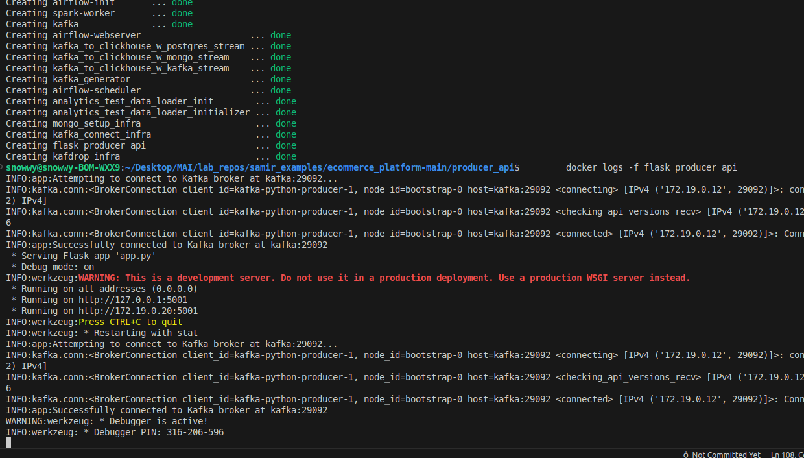
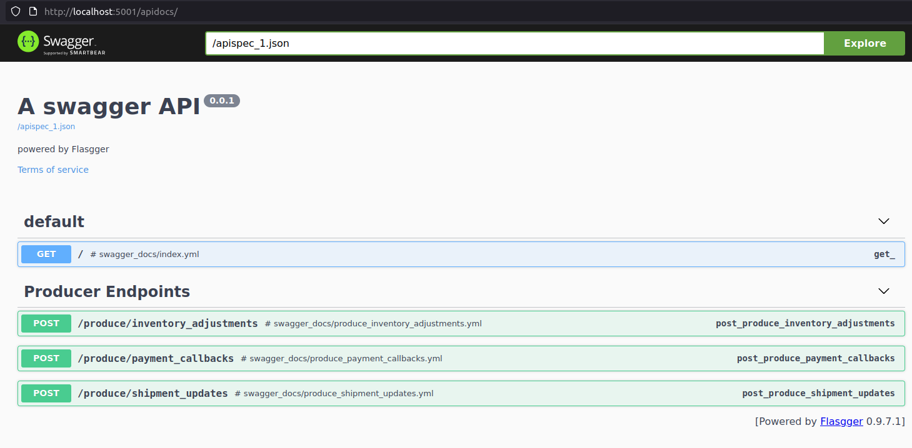
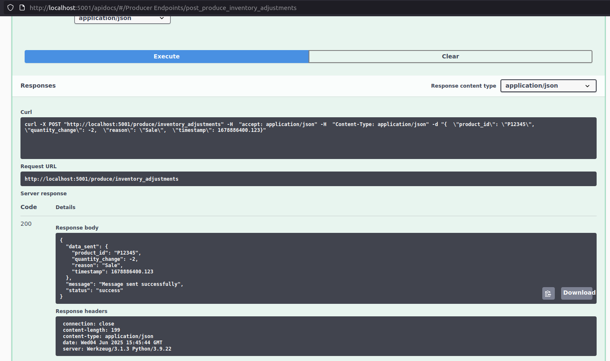
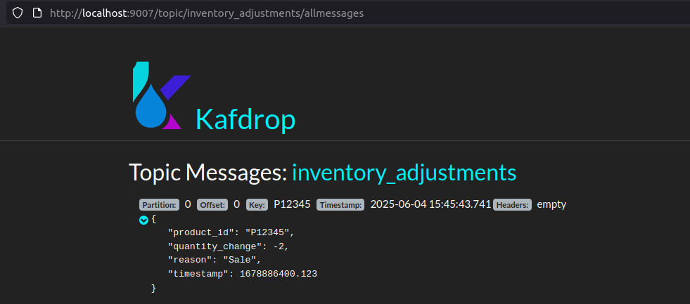

# **Инструкция по развертыванию проекта `ecommerce_platform`**

- Для неуказанных в инструкции сервисов подразумевается автоматическая инициализация.

**Шаг 1: Клонирование репозитория и начальная настройка**

1.  **Клонирование репозитория**:
    ```bash
    git clone <URL_GIT_РЕПОЗИТОРИЯ>
    cd ecommerce_platform
    ```

2. **Смена прав доступа на запись**:

    ```bash
    # Из директории ecommerce_platform-main/
    sudo chown -R 50000:50000 ./batching/dags
    sudo chmod -R 775 ./batching/dags 
    ```


3.  **Создание ключа для MongoDB Replica Set:**
    ```bash
    cd infra/mongo/
    chmod ugo+x create_mongo_key.sh # Делаем скрипт исполняемым
    sudo    ./create_mongo_key.sh          # Запускаем скрипт (может запросить пароль sudo)
    ```
    *   **Проверка (опционально):** Убедитесь, что файл `mongo-keyfile` создан в текущей директории (`infra/mongo/`) и имеет права `400`.
        ```bash
        ls -l mongo-keyfile
        # sudo cat mongo-keyfile # Чтобы посмотреть содержимое, если очень нужно, но не обязательно
        ```
    ```bash
    cd .. # Вернуться в infra/
    ```

**Шаг 2: Запуск и настройка инфраструктуры**

4.  **Создание Docker-сети** (если еще не создана; команда идемпотентна, не вызовет ошибку, если сеть уже есть):
    ```bash
    docker network create ecommerce_network
    ```

5.  **Запуск инфраструктурных сервисов (PostgreSQL, MongoDB, Kafka, Zookeeper, Kafka Connect, Kafdrop):**
    *Убедитесь, что вы находитесь в директории `ecommerce_platform/`*
    ```bash
    cd .. 
    docker compose -f docker-compose.yml up -d
    ```

6.  **Ожидание и проверка готовности инфраструктуры:**
    *   Подождите примерно 1-2 минуты.
    *   Проверьте статус контейнеров:
        ```bash
        docker ps
        ```
        *   `postgres_ecommerce`, `mongo_ecommerce`, `zookeeper_infra`, `kafka_infra` должны быть `(healthy)`.
        *   `mongo_setup_infra` должен быть `Exited (0)`.
        *   `kafka_connect_infra` должен стать `(healthy)`. Это может занять некоторое время.
        *   `kafdrop_infra` должен быть `Up`.
    *   Если `kafka_connect_infra` долго не становится `healthy`, проверьте его логи:
        ```bash
        docker logs -f kafka_connect_infra
        ```

7.  **Добавление тестовых данных в базы данных (чтобы появились топики Debezium):**
    *   **MongoDB:**
        *Убедитесь, что вы находитесь в директории `ecommerce_platform/infra/`*
        ```bash
        cd infra/mongo/
        chmod +x fill_mongo.sh # Если это имя вашего скрипта для MongoDB
        ./fill_mongo.sh       # Запускаем скрипт (может быть другим, например fill_mongo.sh)
        cd .. # Вернуться в infra/
        ```

    *   Проверка `postgres/init.sql` (должен быть добавлен 1 элемент)

    ```sh
    docker exec -it postgres_ecommerce psql -U pguser -d ecommerce_db

    SELECT * from products;

    ```


8.  **Регистрация Debezium коннекторов:**
    *Убедитесь, что вы находитесь в директории `ecommerce_platform/infra/` и `kafka_connect_infra` (healthy).*
    *Сделайте скрипт исполняемым:*
    ```bash
    chmod +x register_connectors.sh
    ```
    *Запустите скрипт:*
    ```bash
    ./register_connectors.sh
    ```
    *   Скрипт должен показать успешную регистрацию и статус `HTTP 201` для обоих коннекторов (`pg-ecommerce-connector` и `mongo-ecommerce-connector`).


9.  **Проверка создания топиков Debezium в Kafdrop:**
    *   Откройте в браузере: http://localhost:9007/
    *   Убедитесь, что появились топики для отслеживаемых таблиц PostgreSQL (например, `pg_ecomm_cdc.public.users`) и коллекций MongoDB (например, `mongo_ecomm_cdc.ecommerce_db.user_profiles_mongo`), и в них есть сообщения.


**Шаг 3: Тестирование Producer API**

- Детальное описание Producer API в директории `ecommerce_platform-main/producer_api`

10. **Проверка статуса и логов Producer API:**
    *   Проверьте статус:
        ```bash
        docker ps | grep flask_producer_api
        ```
        Должен быть `Up`.
    *   Проверьте `producer_api/app/Dockerfile` и `docker-compose.yml` на соответствие портов Kafka.
    *   Проверьте логи на ошибки и успешное подключение к Kafka:
        ```bash
        docker logs -f flask_producer_api
        docker logs -f kafka
        ```




11. **Тестирование эндпоинтов API через Swagger UI:**




    *   Откройте в браузере: http://localhost:5001/apidocs/
    *   Для каждого POST-эндпоинта:
        *   Разверните его.
        *   Нажмите "Try it out".
        *   Нажмите "Execute".
        *   Убедитесь, что ответ сервера `200 OK` и содержит `"status": "success"`.





12. **Проверка создания топиков API в Kafdrop:**
    *   Вернитесь в Kafdrop: http://localhost:9007/
    *   Убедитесь, что появились топики, в которые пишет ваш API (например, `inventory_adjustments`, `payment_gateway_callbacks`, `shipment_status_updates`), и в них есть сообщения, отправленные через Swagger UI.




---

**Шаг 4: Запуск и тестирование streaming**

- Инструкция в директории `ecommerce_platform-main/streaming`


**Шаг 5: Запуск и тестирование batching**

- Инструкция в директории `ecommerce_platform-main/batching`

**Шаг 6: Запуск и тестирование analytics**

- Инструкция в директории `ecommerce_platform-main/analytics`

**Шаг 7: Запуск и тестирование tracing_logging_metrics**
