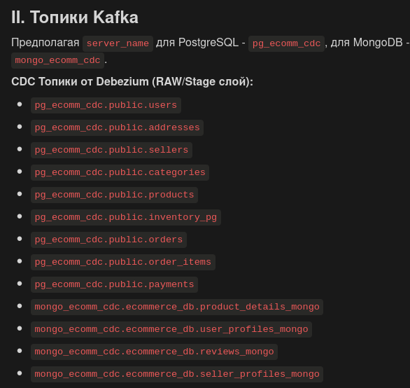
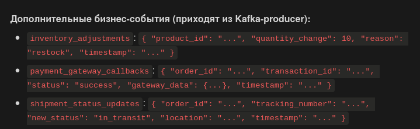

## 1. Спецификация **`producer_api`**

| Endpoint | Метод | Описание | Ожидаемые параметры (JSON body) | Возвращаемый результат | Коды состояния HTTP |
|---|---|---|---|---|---|
| `/` | GET | Проверяет статус работы API и подключения к Kafka. | Нет | Сообщение о статусе API и подключения к Kafka. | `200 OK` (если подключено), `503 Service Unavailable` (если нет) |
| `/produce/inventory_adjustments` | POST | Отправляет данные об изменении запасов товаров в топик `inventory_adjustments` Kafka. | `product_id` (string), `quantity_change` (number), `reason` (string) | `{"status": "success", "message": "...", "data_sent": {...}}` или `{"status": "error", "message": "..."}` | `200 OK`, `400 Bad Request`, `500 Internal Server Error` |
| `/produce/payment_callbacks` | POST | Отправляет данные об обратных вызовах платежного шлюза (статус платежа) в топик `payment_gateway_callbacks` Kafka. | `order_id` (string), `transaction_id` (string), `status` (string), `gateway_data` (object) | `{"status": "success", "message": "...", "data_sent": {...}}` или `{"status": "error", "message": "..."}` | `200 OK`, `400 Bad Request`, `500 Internal Server Error` |
| `/produce/shipment_updates` | POST | Отправляет обновления статуса отгрузки в топик `shipment_status_updates` Kafka. | `order_id` (string), `tracking_number` (string), `new_status` (string) | `{"status": "success", "message": "...", "data_sent": {...}}` или `{"status": "error", "message": "..."}` | `200 OK`, `400 Bad Request`, `500 Internal Server Error` |

## 2. Топики Kafka

## 3. Спецификация сообщения в producer_api

