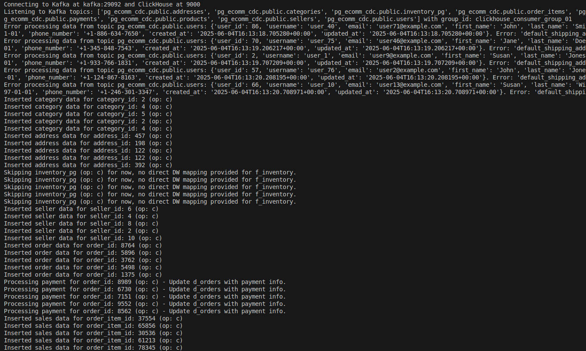
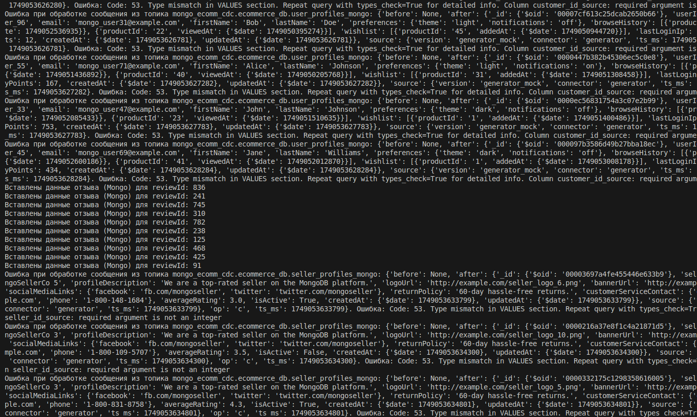
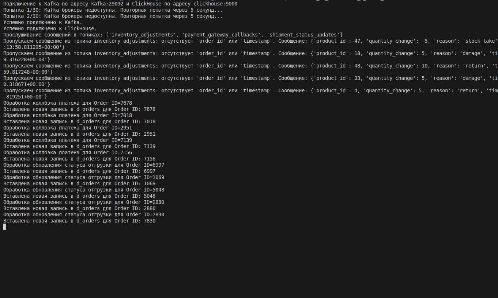

## 1. Структура модуля **`streaming`**

```
ecommerce_platform/
├── streaming/
│   └── app/
│   │    ├── mongo_streaming/
│   │    │       ├── Dockerfile.mongo_stream
│   │    │       └── mongo_streaming.py
│   │    ├── postgres_streaming/
│   │    │       ├── Dockerfile.postgres_stream
│   │    │       └── postgres_streaming.py
│   │    ├── producer_streaming/
│   │    │       ├── Dockerfile.kafka_streaming
│   │    │       └── kafka_streaming.py
│   │    ├── streaming_data_generator/
│   │    │       ├── Dockerfile.kafka_generator
│   │    │       └── kafka_generator.py
|   │    └── requirements.txt   
│   ├── launch_instruction_streaming.md 
│   └── README.md
├── docker-compose.yml            # Основной docker-compose файл
```

| Зависимые компоненты модуля |
| :------------------------------------ |
| kafdrop |
| kafka-connect |
| kafka |
| zookeeper |
| mongo |
| mongo-setup |
| postgres |


## 2. Принцип работы стриминга

- Работает круглосуточно
- Восстанавливается с места падения 


## 3. Проверка pull-модели (прослушивание и запись полученных данных)

- Для PostgreSQL




- Для MongoDB




- Для kafka_streaming


